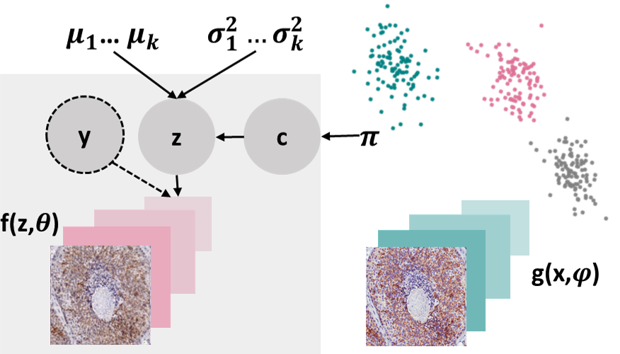

# VaDE Model Summary

Variational Deep Embedding (VaDE) [1] is an unsupervised generative clustering
approach based on Variational Autoencoders [2]. 

In this library, VaDE can be deployed as a deep clustering model using both Artificial Neural Network (ANN) and 
Convolutional Neural Network (CNN) architectures for the encoder ***(x,φ)*** and the decoder ***f(z,θ)***. 

The encoder learns to compress the high-dimensional input images ***x*** into lower-dimensional latent representations ***z***.

Using a Mixture-of-Gaussians (MOG) prior distribution for the latent representations ***z***, we examine
sub-groups or domains within the dataset, revealed by the individual Gaussians within the learned 
latent space, and how ***z*** affects the generation of ***x***. 

The model can be used to perform inference, where observed images ***x*** are mapped to a series of corresponding 
latent variables ***z*** and their cluster/domain assignments ***c***.

We denote the latent space dimensionality by ***d*** (i.e., ***z ∈ R^d***), and the number of 
clusters by ***D*** (i.e., ***c ∈ {1, 2, ..., D}***).

The decoder CNN generates images ***x*** from latent space samples ***z***.
Thus, the trained decoder CNN can also be used to generate synthetic images from the algorithmically identified subgroups.
VaDE is optimized using Stochastic Gradient Variational Bayes cite{kingmaAutoEncodingVariationalBayes2013} to maximize
a statistical measure called the Evidence Lower Bound (ELBO).

[1] Jiang, Zhuxi, et al. "Variational deep embedding: An unsupervised and generative approach to clustering." 
arXiv preprint arXiv:1611.05148 (2016).(https://arxiv.org/abs/1611.05148)

[2] Kingma, Diederik P., and Max Welling. "Auto-encoding variational bayes." arXiv preprint arXiv:1312.6114 (2013) (https://arxiv.org/abs/1312.6114) 

# CDVaDE Model  Summary 
 In this package, we also present the CDVaDE model as an expansion to VaDE, referred to as the Conditionally Decoded 
 Variational Deep Embedding. CDVaDE's generative process is different from VaDE's because it combines extra variables 
***y*** with the latent representation ***z***. These variables may include class labels or existing subgroup structures 
 that do not need to be identified. It is expected that these additional variables ***y*** are accessible during both
 training and testing.
# DEC Model Summary 
Deep embedding clustering is a method of unsupervised learning that combines deep neural networks with clustering 
techniques to discover latent representations of data points. The implementation in this package is aimed to compare
another state-of-the-art clustering algorithms to the novel CDVaDE one. DEC involves first training a deep neural 
network to learn a low-dimensional representation of the data, and then using clustering algorithms to group similar 
data points based on their embeddings. 
# M2YD Model Summary