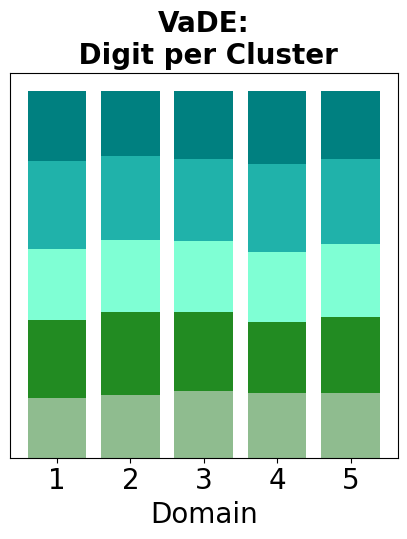

All of the experiments below can be reproduced with the following commit:
8d29ed50871e052a9d681ae7655121e54bd9990e


# MNIST 5 digits and 5 numbers

## VaDE:
```commandline
poetry run python main_out.py --te_d 0 --tr_d 0 1 2 3 4 --task=mnistcolor10 --digits_from_mnist 0 1 2 3 4 --epos=20 --aname=vade --zd_dim=20 --d_dim=5 --apath=domid/algos/builder_vade.py --L=5 --pre_tr=7 --bs 2 --lr 0.0005 --split 0.8 --prior Gaus --model cnn
```


 

```
Epoch 20.
pi:
[0.19953196 0.20016593 0.200557   0.1989228  0.20082237]
epoch: 20
pooled train clustering acc (vec_d correlation):  1.0
[[232   0   0   0   0]
 [  0 232   0   0   0]
 [  0   0 232   0   0]
 [  0   0   0 232   0]
 [  0   0   0   0 232]]
clustering validation acc:  1.0
[[58  0  0  0  0]
 [ 0 58  0  0  0]
 [ 0  0 58  0  0]
 [ 0  0  0 58  0]
 [ 0  0  0  0 58]]
pooled train clustering acc (vec_y correlation):  0.20862068965517241
[[13 10 11 12 12]
 [11 13 14  9 11]
 [ 9 11 15 11 12]
 [10  8 11 16 13]
 [10 11 13 13 11]]
```


## CDVaDE results:
```commandline
poetry run python main_out.py --te_d 0 --tr_d 0 1 2 3 4 --task=mnistcolor10 --digits_from_mnist 0 1 2 3 4 --epos=20 --aname=vade --zd_dim=20 --d_dim=5 --apath=domid/algos/builder_vade.py --L=5 --pre_tr=10 --bs 2 --lr 0.0005 --split 0.8 --prior Gaus --model cnn  --dim_inject_y 5 --inject_var "color"
```

 

```
epoch: 20
pooled train clustering acc (vec_d correlation):  0.3922413793103448
[[130   7 127 127   6]
 [ 13 183  13  11 180]
 [ 43   0  42  40   0]
 [ 46   0  50  54   0]
 [  0  42   0   0  46]]
clustering validation acc:  0.40344827586206894
[[33  3 34 34  3]
 [ 4 44  2  2 40]
 [11  0 13 10  0]
 [10  0  9 12  0]
 [ 0 11  0  0 15]]
pooled train clustering acc (vec_y correlation):  0.44655172413793104
[[37 34  2  3 31]
 [27 24 17  2 22]
 [ 0  0 34  0  0]
 [ 0  1  0 30  0]
 [ 0  0  0 26  0]]

```

# DEC
```commandline
poetry run python main_out.py --te_d 0 --tr_d 0 1 2 3 4 --task=mnistcolor10 --digits_from_mnist 0 1 2 3 4 --epos=20 --aname=dec --zd_dim=20 --d_dim=5 --apath=domid/algos/builder_dec.py --L=5 --pre_tr=10 --bs 2 --lr 0.0005 --split 0.8 --prior Gaus --model cnn
```
 

```
epoch: 20
pooled train clustering acc (vec_d correlation):  1.0
[[232   0   0   0   0]
 [  0 232   0   0   0]
 [  0   0 232   0   0]
 [  0   0   0 232   0]
 [  0   0   0   0 232]]
clustering validation acc:  1.0
[[58  0  0  0  0]
 [ 0 58  0  0  0]
 [ 0  0 58  0  0]
 [ 0  0  0 58  0]
 [ 0  0  0  0 58]]
pooled train clustering acc (vec_y correlation):  0.20862068965517241
[[11 10 13 13 11]
 [12 13 11 12 10]
 [12  9 15 11 11]
 [13 10 11 16  8]
 [11 11 14  9 13]]

```

# MNIST 10 digits and 10 colors
# VaDE 

```commandline
poetry run python main_out.py --te_d 0 --tr_d 0 1 2 3 4 5 6 7 8 9 --task=mnistcolor10 --epos=20 --aname=vade --zd_dim=20 --d_dim=10 --apath=domid/algos/builder_vade.py --L=5 --pre_tr=9 --bs 2 --lr 0.0005 --split 0.8 --prior Gaus --model cnn
```

 

```
Epoch 20.
pi:
[0.09935287 0.10019217 0.10112603 0.09998804 0.09944636 0.10044938
 0.099592   0.09958086 0.10075232 0.09952003]
epoch: 20
pooled train clustering acc (vec_d correlation):  1.0
[[480   0   0   0   0   0   0   0   0   0]
 [  0 480   0   0   0   0   0   0   0   0]
 [  0   0 480   0   0   0   0   0   0   0]
 [  0   0   0 480   0   0   0   0   0   0]
 [  0   0   0   0 480   0   0   0   0   0]
 [  0   0   0   0   0 480   0   0   0   0]
 [  0   0   0   0   0   0 480   0   0   0]
 [  0   0   0   0   0   0   0 480   0   0]
 [  0   0   0   0   0   0   0   0 480   0]
 [  0   0   0   0   0   0   0   0   0 480]]
clustering validation acc:  1.0
[[120   0   0   0   0   0   0   0   0   0]
 [  0 120   0   0   0   0   0   0   0   0]
 [  0   0 120   0   0   0   0   0   0   0]
 [  0   0   0 120   0   0   0   0   0   0]
 [  0   0   0   0 120   0   0   0   0   0]
 [  0   0   0   0   0 120   0   0   0   0]
 [  0   0   0   0   0   0 120   0   0   0]
 [  0   0   0   0   0   0   0 120   0   0]
 [  0   0   0   0   0   0   0   0 120   0]
 [  0   0   0   0   0   0   0   0   0 120]]
pooled train clustering acc (vec_y correlation):  0.10875
[[18 17 10  8 11 16  8 13 12  7]
 [12 18 11 15 13 11 11 13  7  9]
 [ 9 12 19 10 13  9 11 14 12 11]
 [12 16 10 23  9 13  9 15  7  6]
 [12 15 14 11 13 14 10  9 11 11]
 [12 12  8 19 10 15 10 13 10 11]
 [10 14 13 11 13  9 20 17  5  8]
 [17 14  8 16  9 10 12 14 10 10]
 [ 8 16 13 12  5 11 15 15 13 12]
 [11 15 13 14 11 13 11  4 14 14]]

```

## CDVaDE
```commandline
poetry run python main_out.py --te_d 0 --tr_d 0 1 2 3 4 5 6 7 8 9 --task=mnistcolor10 --epos=20 --aname=vade --zd_dim=20 --d_dim=10 --apath=domid/algos/builder_vade.py --L=5 --pre_tr=10 --bs 2 --lr 0.0005 --split 0.8 --prior Gaus --model cnn --inject_var "color" --dim_inject 10
```
 

``` 
Epoch 20.
pi:
[0.281116   0.0581153  0.03795863 0.04543419 0.03187253 0.03154486
 0.05845225 0.04034997 0.38605252 0.02910378]
epoch: 20
pooled train clustering acc (vec_d correlation):  0.14875
[[178 175 176 168  71  75  86  75 158  67]
 [ 60  64  58  53   0   0   0   0  52   0]
 [ 43  43  50  44   0   0   0   0  46   0]
 [ 21  18  23  20  29  34  28  24  18  35]
 [  5  12   9  14  36  29  32  30  15  32]
 [  1   0   0   0  34  37  36  34   0  36]
 [  8   7   8   4  43  49  48  51   3  37]
 [  0   0   0   0  36  50  44  53   0  46]
 [164 161 156 177 198 173 170 177 188 187]
 [  0   0   0   0  33  33  36  36   0  40]]
clustering validation acc:  0.17416666666666666
[[47 42 40 45 39 17 23 15 17 13]
 [15 23 21 17 12  0  0  0  0  0]
 [ 7  6 13 11  7  0  0  0  0  0]
 [ 6  5  4  6  6  7  4  5  4 10]
 [ 1  2  3  2  5  5 10  7 11 10]
 [ 0  0  0  0  0  8 10  6  3  8]
 [ 1  2  2  4  2 11 15  8  9 12]
 [ 0  0  0  0  0 16  6 16  7  8]
 [43 40 37 35 49 47 43 52 63 46]
 [ 0  0  0  0  0  9  9 11  6 13]]
pooled train clustering acc (vec_y correlation):  0.2725
[[54 26 43 15  5 40 35 19 47 14]
 [ 1 34  0 26  0  0  1 26  0  0]
 [ 1  0  0  3  0  0  0  0  0 40]
 [ 0  0  0 29  0  9 14  0  5  0]
 [ 2  2  0  9 42  0  0  0  1  0]
 [ 1  2  4 10  0  4  0  2  0 12]
 [ 5  0  2  8  1  2 23  0 25  0]
 [ 0 27  0  5  0  0  0 21  0  0]
 [62 28 50 34 53 62 48 39 71  8]
 [ 1  0  0  0  0  0  0  0  0 47]]

```

## DEC 
```commandline
poetry run python main_out.py --te_d 0 --tr_d 0 1 2 3 4 5 6 7 8 9 --task=mnistcolor10 --epos=20 --aname=dec --zd_dim=20 --d_dim=10 --apath=domid/algos/builder_dec.py --L=5 --pre_tr=10 --bs 2 --lr 0.00005 --split 0.8 --prior Gaus --model cnn
```

 

```
epoch: 20
pooled train clustering acc (vec_d correlation):  1.0
[[480   0   0   0   0   0   0   0   0   0]
 [  0 480   0   0   0   0   0   0   0   0]
 [  0   0 480   0   0   0   0   0   0   0]
 [  0   0   0 480   0   0   0   0   0   0]
 [  0   0   0   0 480   0   0   0   0   0]
 [  0   0   0   0   0 480   0   0   0   0]
 [  0   0   0   0   0   0 480   0   0   0]
 [  0   0   0   0   0   0   0 480   0   0]
 [  0   0   0   0   0   0   0   0 480   0]
 [  0   0   0   0   0   0   0   0   0 480]]
clustering validation acc:  1.0
[[120   0   0   0   0   0   0   0   0   0]
 [  0 120   0   0   0   0   0   0   0   0]
 [  0   0 120   0   0   0   0   0   0   0]
 [  0   0   0 120   0   0   0   0   0   0]
 [  0   0   0   0 120   0   0   0   0   0]
 [  0   0   0   0   0 120   0   0   0   0]
 [  0   0   0   0   0   0 120   0   0   0]
 [  0   0   0   0   0   0   0 120   0   0]
 [  0   0   0   0   0   0   0   0 120   0]
 [  0   0   0   0   0   0   0   0   0 120]]
pooled train clustering acc (vec_y correlation):  0.10875
[[13 14 11  9 14 11 12 11 15 10]
 [13 19 11 14  9 12  9 10 12 11]
 [11 13 14  4 13 14 11 14 15 11]
 [ 9  8 10 14 10 10 17 16 14 12]
 [10  8 11 13 15 10 12 19 12 10]
 [ 5 13 12 15 11 13  8 12 16 15]
 [11 10  7 13 16 12 18  8 17  8]
 [ 9 10  6 15 13  7 12 23 16  9]
 [13 11  9 13 11  7 12 15 18 11]
 [13 13  8 17  9  5 10 11 14 20]]
 
```
# HER 2 
## VaDE

```commandline
poetry run python main_out.py --te_d 0 --tr_d 0 1 2 --task=her2 --epos=15 --aname=vade --zd_dim=500 --d_dim=3 --apath=domid/algos/builder_vade.py --L=5 --pre_tr=4 --dpath "../../HER2/combined_train" --bs 4 --prior Gaus --model cnn --lr 0.000005
```
```
epoch: 15
pooled train clustering acc (vec_d correlation):  0.4642857142857143
[[187  42  38]
 [ 60 106   3]
 [117 100  19]]
clustering validation acc:  0.4583333333333333
[[186  44  34]
 [ 60 103   7]
 [118 101  19]]
pooled train clustering acc (vec_y correlation):  0.40922619047619047
[[100  61 103]
 [ 18  59  93]
 [ 50  48 140]]
Correlation with HER2 scores training 0.3636187188749541
Correlation with HER2 scores validation 0.4149980450323623

```

## CDVaDE

```commandline
 poetry run python main_out.py --te_d 0 --tr_d 0 1 2 --task=her2 --epos=15 --aname=vade --zd_dim=500 --d_dim=3 --apath=domid/algos/builder_vade.py --L=5 --pre_tr=4 --dpath "../../HER2/combined_train" --bs 4 --prior Gaus --model cnn --lr 0.000005 --dim_inject_y 3 --inject_var "class"
```
```
epoch: 15
pooled train clustering acc (vec_d correlation):  0.4538690476190476
[[  5  88  60]
 [ 16 112 116]
 [ 39  48 188]]
clustering validation acc:  0.46875
[[  5  89  47]
 [ 14 108 115]
 [ 41  51 202]]
pooled train clustering acc (vec_y correlation):  0.4270833333333333
[[ 49  76  16]
 [ 52 135  50]
 [ 67 125 102]]
Correlation with HER2 scores training 0.40958702786986895
Correlation with HER2 scores validation 0.4135975037289631
```
 

| dataset | model  | train_acc_y       | test_acc_y        | train_acc_d       | test_acc_d        | train_loss       | test_loss        | R with scores train | R with scores test |
|---------|--------|-------------------|-------------------|-------------------|-------------------|------------------|------------------|---------------------|--------------------|
| her2    | cdvade | 0.421130952380952 | 0.410714285714286 | 0.513392857142857 | 0.514880952380952 | 24274.9782409668 | 253.425643920898 | 0.399222357577121   | 0.375552994731988  |
| her2    | vade   | 0.425595238095238 | 0.418154761904762 | 0.453869047619048 | 0.447916666666667 | 22727.3095474243 | 115.21866607666  | 0.396636824017515   | 0.388826721494123  |


## VaDE (different number of pretraining epochs)

```commandline
poetry run python main_out.py --te_d 0 --tr_d 0 1 2 --task=her2 --epos=15 --aname=vade --zd_dim=500 --d_dim=3 --apath=domid/algos/builder_vade.py --L=5 --pre_tr=12 --dpath "../../HER2/combined_train" --bs 4 --prior Gaus --model cnn --lr 0.000005
```


The first two rows are the results of the experiments above, and the last one is modified.

| dataset | model  | train_acc_y       | test_acc_y        | train_acc_d       | test_acc_d        | train_loss       | test_loss        | R with scores train | R with scores test |
|---------|--------|-------------------|-------------------|-------------------|-------------------|------------------|------------------|---------------------|--------------------|
| her2    | cdvade | 0.421130952380952 | 0.410714285714286 | 0.513392857142857 | 0.514880952380952 | 24274.9782409668 | 253.425643920898 | 0.399222357577121   | 0.375552994731988  |
| her2    | vade   | 0.425595238095238 | 0.418154761904762 | 0.453869047619048 | 0.447916666666667 | 22727.3095474243 | 115.21866607666  | 0.396636824017515   | 0.388826721494123  |
| her2    | vade   | 0.410714285714286 | 0.404761904761905 | 0.473214285714286 | 0.494047619047619 | 22028.3210411072 | 149.957138061523 | 0.438361904651605   | 0.452394076973467  |
